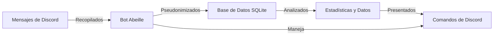

# Abeille 🐝

 

> Un potente bot de Discord para recopilar y analizar estadísticas y datos de mensajes de tus servidores.

## 📋 Tabla de Contenidos

- [Abeille 🐝](#abeille-)
  - [📋 Tabla de Contenidos](#-tabla-de-contenidos)
  - [Descripción general](#overview)
  - [Características](#features)
  - [Dependencias](#dependencies)
  - [Ejecuta tu propia Abeille](#run-your-own-abeille)
    - [Configuración inicial](#setting-up)
    - [Variables de Entorno](#environment-variables)
    - [Ejecución](#run)
  - [Desarrollo](#development)
    - [Primeros pasos](#getting-started)
    - [Actualizar el proyecto](#updating-project)
  - [Comandos](#commands)
    - [Comandos de Actividad](#activity-commands)
    - [Comandos de Mensajes](#message-commands)
    - [Comandos de Administración](#admin-commands)
    - [Comandos de Privacidad](#privacy-commands)
    - [Comandos de Desarrollo (_pueden eliminarse en el futuro_)](#developer-commands-may-be-removed-in-the-future)
    - [Comandos de Utilidad](#utility-commands)
  - [Contribuciones](#contributing)
  - [Documentación](#documentation)
  - [Flujo de Datos](#data-flow)

## Descripción general

Abeille es un bot de Discord que proporciona estadísticas y datos para servidores. Mantiene una base de datos (una por cada servidor) con los mensajes de cada servidor conectado, con el fin de realizar operaciones de búsqueda eficientes y variadas (ya que Discord no proporciona ninguna API para realizar búsquedas).

## Características

- Guarda mensajes de servidores monitoreados mientras utiliza pseudonimización.
- Proporciona comandos slash para graficar expresiones en tendencia y mostrar mensajes aleatorios.
- Análisis de actividad que incluye clasificaciones y comparaciones de usuarios.
- Visualización de tendencias de mensajes y análisis estadístico.
- Comandos de administración para la gestión de canales y manejo de datos.
- Controles de privacidad robustos con opciones de exportación y eliminación de datos.
- Soporte completo de localización (actualmente en inglés y francés).
- Operaciones de base de datos optimizadas con SQLite FTS5 para búsqueda de texto eficiente.
- Pseudonimización de datos de usuario para la protección de la privacidad.

## Dependencias

Abeille está construido utilizando las siguientes bibliotecas de código abierto:

- [discord.js](https://github.com/discordjs/discord.js) - Cliente de API de Discord
- [Chart.js](https://github.com/chartjs/Chart.js) - Biblioteca de gráficos para JavaScript
- [ChartjsNodeCanvas](https://github.com/SeanSobey/ChartjsNodeCanvas) - Renderizado de canvas para Chart.js en Node.js
- [winston](https://github.com/winstonjs/winston) - Biblioteca de registro de logs
- [date-fns](https://github.com/date-fns/date-fns) - Biblioteca para manipulación de fechas
- [chartjs-adapter-date-fns](https://github.com/chartjs/chartjs-adapter-date-fns) - Adaptador de fechas para Chart.js
- [nodejs-polars](https://github.com/pola-rs/nodejs-polars) - Biblioteca de manipulación de datos
- [sharp](https://github.com/lovell/sharp) - Biblioteca de procesamiento de imágenes

## Ejecuta tu propia Abeille

Puedes ejecutar tu propia instancia de Abeille siguiendo estos pasos:

### Configuración inicial

1. Crea una carpeta
2. Copia [compose.yaml.template](compose.yaml.template) en la carpeta
3. Renómbralo a `compose.yaml`
4. Configura el archivo `compose.yaml`

### Variables de Entorno

| Variable        | Descripción                                                                                                                                                                                                                               | Valor de Ejemplo   | Valor Predeterminado |
| --------------- | ----------------------------------------------------------------------------------------------------------------------------------------------------------------------------------------------------------------------------------------- | ------------------ | -------------------- |
| `DISCORD_TOKEN` | El token para tu bot de Discord. Puedes obtenerlo desde el Portal de Desarrolladores de Discord después de crear una aplicación de bot.                                                                                                  | `your-bot-token`   | _Ninguno_            |
| `GUILD_ID`      | _(Opcional, recomendado para desarrollo)_ El ID del servidor de Discord en el que deseas que el bot opere. Puedes encontrarlo habilitando el Modo Desarrollador en Discord y haciendo clic derecho en el nombre del servidor.                 | `123456789012345678` | _Ninguno_            |
| `OWNER_ID`      | Tu ID de Discord. Se usa para comandos especiales.                                                                                                                                                                                        | `123456789012345678` | _Ninguno_            |
| `HASHNAME`      | El algoritmo de hash utilizado para la pseudonimización hmac (si no sabes cuál elegir, deja el valor predeterminado).                                                                                                                      | `sha256`           | `sha512`             |
| `ITER`          | El número de iteraciones para operaciones de hash. Un valor más alto aumenta la seguridad pero puede afectar el rendimiento.                                                                                                                | `10000`            | `100000`             |
| `SALT`          | Una cadena aleatoria utilizada para añadir seguridad adicional al proceso de hash. Genera una cadena aleatoria segura. La longitud recomendada es 16 (cf. [NIST SP 800-132](https://nvlpubs.nist.gov/nistpubs/Legacy/SP/nistspecialpublication800-132.pdf)). | `random-salt-string` | `bee-default-salt`   |

### Ejecución

Ahora puedes iniciar Abeille ejecutando el siguiente comando:

```bash
docker compose up -d --pull always
```

> **Nota**: Por defecto, el archivo `compose.yaml` descargará la etiqueta `latest`, la cual se sube a Docker Hub cada vez que se actualiza la rama `master`.
> Es posible que tengas que ejecutar `docker compose down && docker compose up -d` de vez en cuando para obtener las últimas características (y ejecutar `docker image prune -a` para liberar espacio).

Revisa los registros ejecutando:

```bash
docker logs abeille
```

## Desarrollo

### Primeros pasos

1. Clona el repositorio
2. Instala bun desde el [sitio web de Bun](https://bun.sh/)
3. Copia y renombra `.env.template` a `.env.local` y completa las variables (consulta la configuración de [Variables de Entorno](#environment-variables))
4. Ejecuta `bun install` para instalar las dependencias
5. Ejecuta `bun dev` para iniciar tu bot (o `docker compose up --build`)

### Actualizar el proyecto

```bash
bun update
```

O

```bash
npx npm-check-updates --packageManager=bun
```

## Comandos

Abeille ofrece varios comandos slash agrupados por categoría:

### Comandos de Actividad

- `/trend` - Visualiza tendencias de palabras o frases específicas a lo largo del tiempo.
- `/rank` - Muestra clasificaciones de actividad de usuarios para expresiones específicas.
- `/compare` - Compara la actividad entre diferentes expresiones.

### Comandos de Mensajes

- `/random` - Muestra un mensaje aleatorio del servidor.

### Comandos de Administración

- `/channels` - Lista todos los canales monitoreados y sus contadores de mensajes.
- `/purge` - Limpia los mensajes eliminados de la base de datos. (_puede eliminarse en el futuro_)
- `/save` - Fuerza el guardado completo de todos los mensajes. (_puede eliminarse en el futuro_)
- `/savechannel` - Fuerza el guardado de mensajes de un canal específico. (_puede eliminarse en el futuro_)

### Comandos de Privacidad

- `/delete` - Elimina un mensaje específico de la base de datos de Abeille (si quieres asegurarte de que Abeille haya tomado en cuenta la eliminación de Discord).
- `/export` - Descarga tus datos personales recopilados por Abeille (en formato CSV).
- `/register` - Activa la opción para permitir que Abeille almacene y muestre tu nombre de usuario en las clasificaciones.
- `/unregister` - Desactiva la opción y elimina tu nombre de usuario del almacenamiento de Abeille (y de futuras clasificaciones).

### Comandos de Desarrollo (_pueden eliminarse en el futuro_)

- `/db` - Operaciones de gestión de base de datos.
- `/logging` - Configura el nivel de registro de logs.

### Comandos de Utilidad

- `/ping` - Verifica si el bot responde.

## Contribuciones

¡Las contribuciones a Abeille son bienvenidas! Así es como puedes contribuir:

1. Haz un fork del repositorio
2. Crea una rama de características: `git checkout -b my-new-feature`
3. Confirma tus cambios: `git commit -am 'Agregar alguna característica'`
4. Envía a la rama: `git push origin my-new-feature`
5. Envía un pull request

Asegúrate de que tu código siga el estilo de código existente.

## Documentación

Para obtener información más detallada sobre Abeille, consulta la siguiente documentación:

- [Descripción de la Arquitectura](docs/ARCHITECTURE.md) - Conoce la estructura interna de Abeille
- [Mejores Prácticas de Seguridad](docs/SECURITY.md) - Recomendaciones de seguridad importantes

## Flujo de Datos


