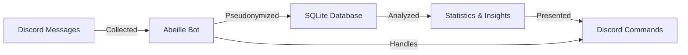

# Abeille 🐝

 

> A powerful Discord bot for collecting and analyzing message statistics and insights for your guilds.

## 📋 Table of Contents

- [Abeille 🐝](#abeille-)
  - [📋 Table of Contents](#-table-of-contents)
  - [Overview](#overview)
  - [Features](#features)
  - [Dependencies](#dependencies)
  - [Run Your Own Abeille](#run-your-own-abeille)
    - [Setting Up](#setting-up)
    - [Environment Variables](#environment-variables)
    - [Run](#run)
  - [Development](#development)
    - [Getting started](#getting-started)
    - [Updating project](#updating-project)
  - [Commands](#commands)
    - [Activity Commands](#activity-commands)
    - [Message Commands](#message-commands)
    - [Admin Commands](#admin-commands)
    - [Privacy Commands](#privacy-commands)
    - [Developer Commands (_may be removed in the future_)](#developer-commands-may-be-removed-in-the-future)
    - [Utility Commands](#utility-commands)
  - [Contributing](#contributing)
  - [Documentation](#documentation)
  - [Data Flow](#data-flow)

## Overview

Abeille is a Discord bot providing statistics and insights for guilds. It maintains a database (one for each guild) with the messages from each connected guild, in order to perform efficient and various search operations (since Discord does not provide any API to perform search operations).

## Features

- Saves messages from tracked guilds while using pseudonymization.
- Provides slash commands to graph trending expressions, show random messages.
- Activity analysis including user rankings and comparison.
- Message trend visualization and statistical analysis.
- Admin commands for channel management and data handling.
- Strong privacy controls with data export and deletion options.
- Full localization support (currently English and French).
- Database operations optimized with SQLite FTS5 for efficient text search.
- User data pseudonymization for privacy protection.

## Dependencies

Abeille is built using the following open source libraries:

- [discord.js](https://github.com/discordjs/discord.js) - Discord API client
- [Chart.js](https://github.com/chartjs/Chart.js) - JavaScript charting library
- [ChartjsNodeCanvas](https://github.com/SeanSobey/ChartjsNodeCanvas) - Node.js canvas rendering for Chart.js
- [winston](https://github.com/winstonjs/winston) - Logging library
- [date-fns](https://github.com/date-fns/date-fns) - Date manipulation library
- [chartjs-adapter-date-fns](https://github.com/chartjs/chartjs-adapter-date-fns) - Date adapter for Chart.js
- [nodejs-polars](https://github.com/pola-rs/nodejs-polars) - Data manipulation library
- [sharp](https://github.com/lovell/sharp) - Image processing library

## Run Your Own Abeille

You can run your own instance of Abeille by following these steps:

### Setting Up

1. Create a folder
2. Copy [compose.yaml.template](compose.yaml.template) into the folder
3. Rename it to `compose.yaml`
4. Configure `compose.yaml` file

### Environment Variables

| Variable        | Description                                                                                                                                                                                                                               | Example Value        | Default Value      |
| --------------- | ----------------------------------------------------------------------------------------------------------------------------------------------------------------------------------------------------------------------------------------- | -------------------- | ------------------ |
| `DISCORD_TOKEN` | The token for your Discord bot. You can obtain this from the Discord Developer Portal after creating a bot application.                                                                                                                   | `your-bot-token`     | _None_             |
| `GUILD_ID`      | _(Optional, recommended for development)_ The ID of the Discord guild (server) you want the bot to operate in. You can find this by enabling Developer Mode in Discord and right-clicking on the server name.                             | `123456789012345678` | _None_             |
| `OWNER_ID`      | Your Discord ID. Used for special commands.                                                                                                                                                                                               | `123456789012345678` | _None_             |
| `HASHNAME`      | The hash algorithm used for hmac pseudonymization (if you don't know what to choose, leave the default value).                                                                                                                            | `sha256`             | `sha512`           |
| `ITER`          | The number of iterations for hashing operations. A higher value increases security but may impact performance.                                                                                                                            | `10000`              | `100000`           |
| `SALT`          | A random string used to add additional security to the hashing process. Generate a secure random string. Recommended length is 16 (cf. [NIST SP 800-132](https://nvlpubs.nist.gov/nistpubs/Legacy/SP/nistspecialpublication800-132.pdf)). | `random-salt-string` | `bee-default-salt` |

### Run

You can now start Abeille by running the following command:

```bash
docker compose up -d --pull always
```

> **Note**: By default, the `compose.yaml` file will pull the `latest` tag, which is pushed to Docker Hub whenever the `master` branch is updated.
> You may have to run `docker compose down && docker compose up -d` from time to time in order to get the latest features (and run `docker image prune -a` to make some space).

Check logs by running:

```bash
docker logs abeille
```

## Development

### Getting started

1. Clone project
2. Install bun from [Bun website](https://bun.sh/)
3. Copy and rename `.env.template` to `.env.local` and complete variables (see [Environment Variables](#environment-variables) configuration)
4. Run `bun install` to install dependencies
5. Run `bun dev` to start your bot

### Updating project

```bash
bun update
```

Or

```bash
npx npm-check-updates --packageManager=bun
```

## Commands

Abeille offers various slash commands grouped by category:

### Activity Commands

- `/trend` - Visualize trends of specific words or phrases over time.
- `/rank` - Show user activity rankings for specific expressions.
- `/compare` - Compare activity between different expressions.

### Message Commands

- `/random` - Display a random message from the guild.

### Admin Commands

- `/channels` - List all tracked channels and their message counts.
- `/purge` - Clean deleted messages from the database. (_may be removed in the future_)
- `/save` - Force a complete save of all messages. (_may be removed in the future_)
- `/savechannel` - Force save messages from a specific channel. (_may be removed in the future_)

### Privacy Commands

- `/delete` - Delete a specific message from Abeille's database (if you want to be sure that Abeille has taken into account the Discord deletion).
- `/export` - Download your personal data collected by Abeille (in CSV).
- `/register` - Opt-in to allow Abeille to store and display your username in rankings.
- `/unregister` - Opt-out and remove your username from Abeille's storage (and future rankings).

### Developer Commands (_may be removed in the future_)

- `/db` - Database management operations.
- `/logging` - Configure logging level.

### Utility Commands

- `/ping` - Check if the bot is responsive.

## Contributing

Contributions to Abeille are welcome! Here's how you can contribute:

1. Fork the repository
2. Create a feature branch: `git checkout -b my-new-feature`
3. Commit your changes: `git commit -am 'Add some feature'`
4. Push to the branch: `git push origin my-new-feature`
5. Submit a pull request

Please make sure your code follows the existing code style.

## Documentation

For more detailed information about Abeille, please see the following documentation:

- [Architecture Overview](docs/ARCHITECTURE.md) - Learn about Abeille's internal structure
- [Security Best Practices](docs/SECURITY.md) - Important security recommendations

## Data Flow


