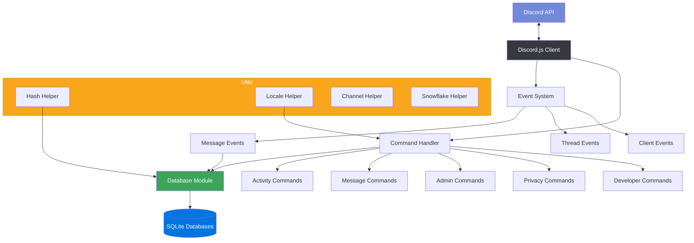

# Abeille Architecture

This document provides an overview of Abeille's architecture and how its components interact.

## High-Level Overview

Abeille is a Discord bot that collects and analyzes messages from guilds. It uses SQLite databases to store message data while maintaining user privacy through pseudonymization.

## Core Components

### 1. Discord Client (`src/abeille.ts`)

Entry point of the application that initializes all required components and connects to Discord.

### 2. Database Module (`src/database/bee-database.ts`)

Handles all database operations including:

- Message storage and retrieval
- User data pseudonymization
- Statistical analysis functions
- Full-text search capabilities

### 3. Command Handler (`src/commands/*`)

Organizes bot commands into categories:

- Activity analysis commands
- Message retrieval commands
- Admin commands
- Privacy-related commands
- Developer utilities

### 4. Event System (`src/events/*`)

Processes Discord events such as:

- Message creation, updating and deletion
- Thread management
- Client initialization
- Interaction handling

### 5. Localization (`src/locales/*`)

Supports multiple languages through a translation system.

### 6. Utility Functions (`src/utils/*`)

Common functions used throughout the codebase:

- Hash helpers for pseudonymization
- Channel management utilities
- Locale handling
- Snowflake ID processing

## Data Flow

1. Users interact with the bot through Discord commands
2. Message events are captured and stored in SQLite databases
3. User identifiers are pseudonymized using the hash helper
4. Commands query the database to generate statistics and insights
5. Results are formatted and returned to Discord

## Privacy Considerations

Abeille takes privacy seriously by:

- Pseudonymizing user identities
- Providing commands to export or delete user data
- Allowing users to opt in/out of data collection
